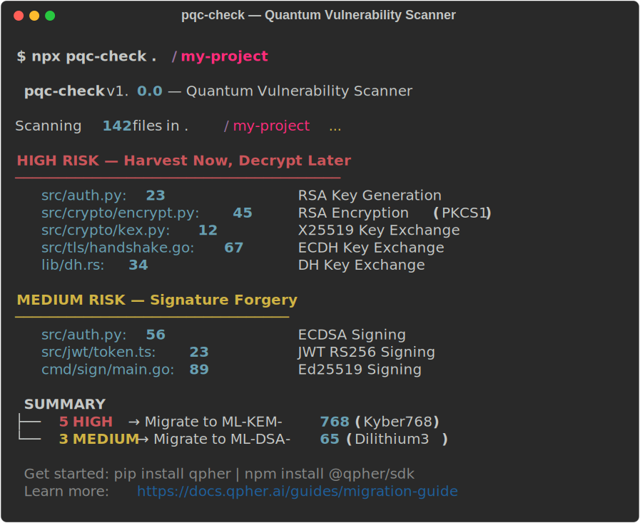

# pqc-check

> Scan your codebase for quantum-vulnerable cryptography

[](https://www.npmjs.com/package/pqc-check)
[](https://www.npmjs.com/package/pqc-check)
[](https://github.com/qpher/pqc-check/actions)
[](./LICENSE)

## Quick Start

```bash
npx pqc-check ./my-project
```

One command. Zero config. Instant results:

<p align="center">
  
</p>

## What It Finds

Quantum computers will break RSA, ECDSA, and Diffie-Hellman using [Shor's algorithm](https://en.wikipedia.org/wiki/Shor%27s_algorithm). Nation-state actors are already harvesting encrypted traffic today to decrypt later. NIST finalized post-quantum standards ([FIPS 203](https://csrc.nist.gov/pubs/fips/203/final), [204](https://csrc.nist.gov/pubs/fips/204/final)) in 2024 — the migration clock is ticking.

**pqc-check** scans your code and categorizes findings by real-world risk:

| Level | Threat | What It Means | Action |
|-------|--------|---------------|--------|
| **HIGH** | Harvest Now, Decrypt Later | Data encrypted today can be decrypted by future quantum computers | Migrate to PQC now |
| **MEDIUM** | Signature Forgery | Authentication can be broken when quantum computers arrive | Plan migration |
| **LOW** | Informational | Already quantum-resistant (e.g. SHA-256) | No action needed |

## Supported Languages

| Language | Extensions | Detection Patterns |
|----------|-----------|-------------------|
| Python | `.py` | RSA, ECDSA, Ed25519, X25519, DH, JWT, SHA |
| JavaScript / TypeScript | `.js` `.ts` `.mjs` `.cjs` `.jsx` `.tsx` | RSA, ECDSA, ECDH, DH, JWT, Web Crypto, node-forge, jose |
| Go | `.go` | RSA, ECDSA, Ed25519, X25519/ECDH |
| Java / Kotlin | `.java` `.kt` | RSA, ECDSA, DH, Bouncy Castle |
| Rust | `.rs` | RSA (rsa/ring crates), ECDSA, Ed25519, X25519 |
| C / C++ | `.c` `.cpp` `.h` `.hpp` | OpenSSL RSA, ECDSA, DH, Ed25519 |
| Ruby | `.rb` | OpenSSL RSA, ECDSA, DH |
| PHP | `.php` | openssl RSA, ECDSA, DH |
| Config files | `.conf` `.yaml` `.toml` `.ini` | SSL certs, PEM keys, TLS cipher suites |

48 detection patterns across 9 languages + config files.

## Installation

```bash
# Run directly (no install needed)
npx pqc-check ./my-project

# Or install globally
npm install -g pqc-check
pqc-check ./my-project
```

## Usage

```bash
# Scan a project (console output)
pqc-check ./my-project

# JSON output (for scripting)
pqc-check ./my-project --format json

# SARIF output (for GitHub Code Scanning)
pqc-check ./my-project --format sarif

# Scan specific languages only
pqc-check ./my-project --lang python,go

# Include LOW risk findings
pqc-check ./my-project --show-low

# Ignore specific paths
pqc-check ./my-project --ignore "tests/**,vendor/**"

# CI-friendly (no banner)
pqc-check ./my-project --quiet

# Hide migration suggestions
pqc-check ./my-project --no-suggestions
```

## CI/CD Integration

### GitHub Actions

```yaml
- name: PQC vulnerability scan
  run: npx pqc-check . --format sarif > results.sarif

- name: Upload SARIF
  uses: github/codeql-action/upload-sarif@v3
  with:
    sarif_file: results.sarif
```

Findings appear directly in your pull request's **Security** tab.

### Exit Codes

| Code | Meaning |
|------|---------|
| `0` | No HIGH or MEDIUM findings |
| `1` | HIGH or MEDIUM findings detected |
| `2` | Error (invalid path, etc.) |

## Output Formats

| Format | Flag | Use Case |
|--------|------|----------|
| **Console** | *(default)* | Human-readable, colored output |
| **JSON** | `--format json` | Scripting, custom integrations |
| **SARIF** | `--format sarif` | GitHub Code Scanning, IDE integration |

## Configuration

### `.pqcignore`

Create a `.pqcignore` file in your project root (same format as `.gitignore`):

```gitignore
# Ignore test files
tests/
test/
*_test.go

# Ignore generated code
generated/
```

pqc-check also respects your existing `.gitignore`.

## Ready to Migrate?

Found quantum-vulnerable code? Here are your options:

| Resource | Link |
|----------|------|
| **PQC Migration Guide** | [docs.qpher.ai/guides/migration-guide](https://docs.qpher.ai/guides/migration-guide) |
| **Qpher PQC APIs** | [qpher.ai](https://qpher.ai) — drop-in encryption + signatures |
| **Free API key** | [portal.qpher.ai/register](https://portal.qpher.ai/register) — free tier, no credit card |
| **Open Quantum Safe** | [openquantumsafe.org](https://openquantumsafe.org) — open-source liboqs |
| **NIST Standards** | [FIPS 203](https://csrc.nist.gov/pubs/fips/203/final) (ML-KEM) · [FIPS 204](https://csrc.nist.gov/pubs/fips/204/final) (ML-DSA) |

### SDKs

```bash
pip install qpher               # Python
npm install @qpher/sdk           # Node.js
go get github.com/qpher/qpher-go # Go
```

## Contributing

Contributions welcome! To add a new language or detection pattern:

1. Create `src/patterns/<language>.ts` following existing patterns
2. Add test fixtures in `tests/fixtures/`
3. Run `npm test` — all tests must pass
4. Submit a PR

## License

[MIT](./LICENSE) — Copyright 2026 [Qpher](https://qpher.ai)

---

<p align="center">
  Built by <a href="https://qpher.ai">Qpher</a> · <a href="https://docs.qpher.ai">Docs</a> · <a href="https://www.linkedin.com/company/qpher">LinkedIn</a> · <a href="https://github.com/qpher/pqc-check">GitHub</a>
</p>
